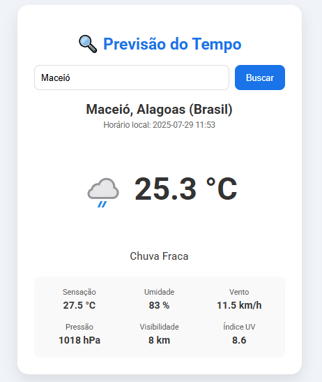

<h1 align="center">🌦️ Previsão do Tempo</h1>

  

## Objetivo

Este projeto tem como objetivo fornecer uma interface simples e intuitiva para consultar a previsão do tempo de qualquer cidade do mundo em tempo real. Basta digitar o nome da cidade e obter informações detalhadas como temperatura, sensação térmica, umidade, vento, pressão, visibilidade, índice UV e horário local.

---

## Ferramentas Utilizadas 🔧

- **HTML5**  
- **CSS3**  
- **JavaScript**
- **[WeatherAPI](https://www.weatherapi.com/)** (API de dados meteorológicos)
- **Google Fonts** (Roboto)

---

## Como Usar ❔

1. Clone este repositório ou baixe os arquivos.
2. Abra o arquivo `index.html` em seu navegador.
3. Digite o nome da cidade desejada e clique em "Buscar".

---

## Imagem do Projeto 📷

---

## Desenvolvedor 👨‍💻

- **Nome:** Erick Avelino 
- **E-mail:** erickdavi200308@gmail.com

---

## Licença

Esse projeto está sob a licença MIT.